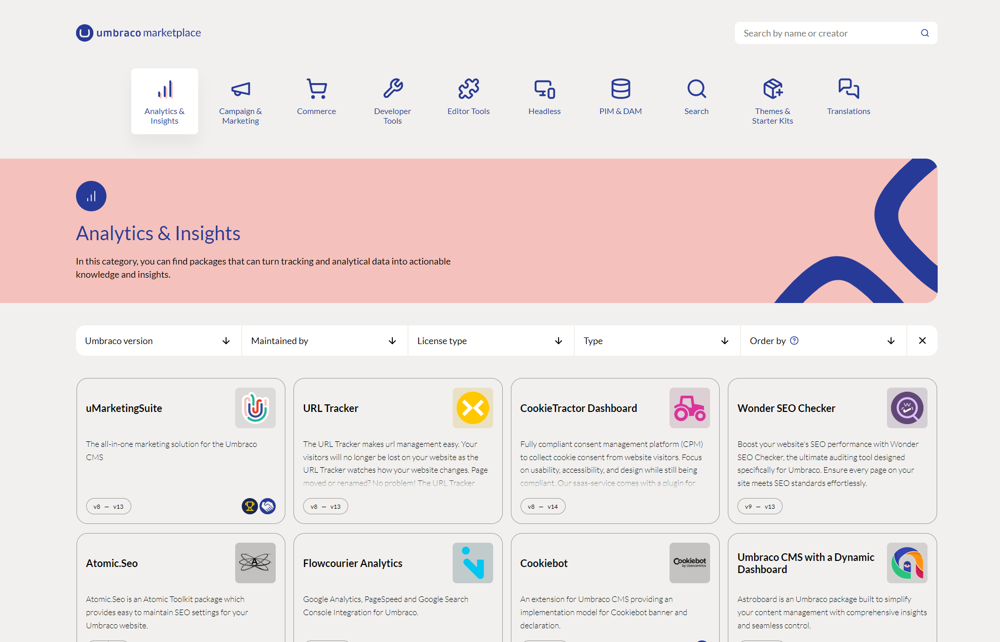
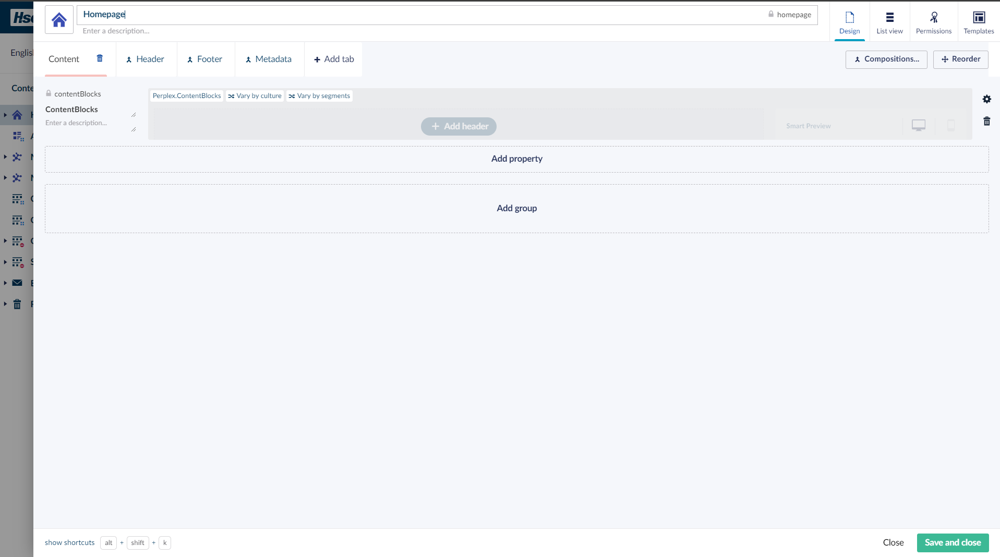
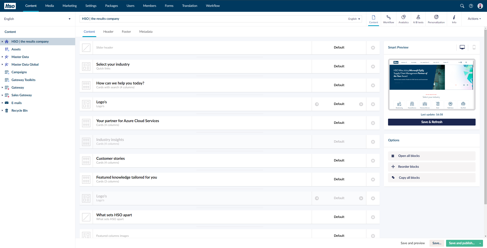
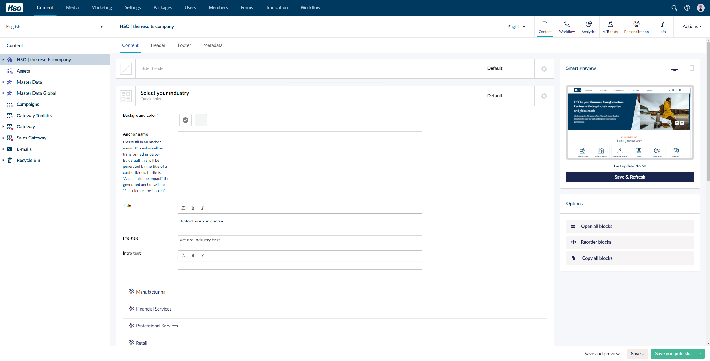
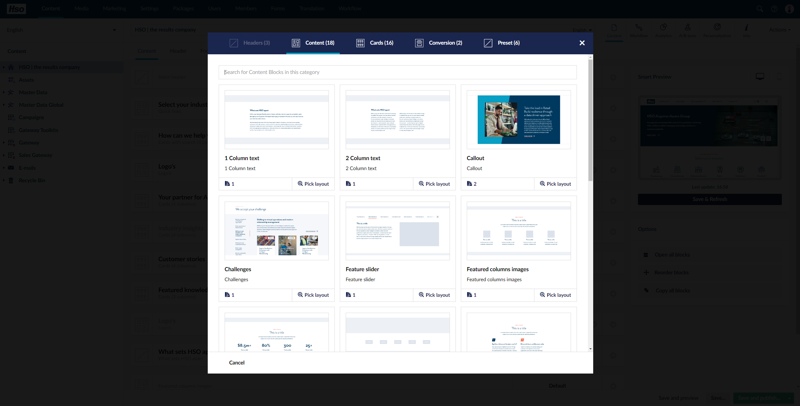
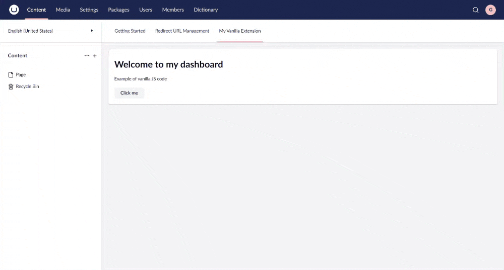
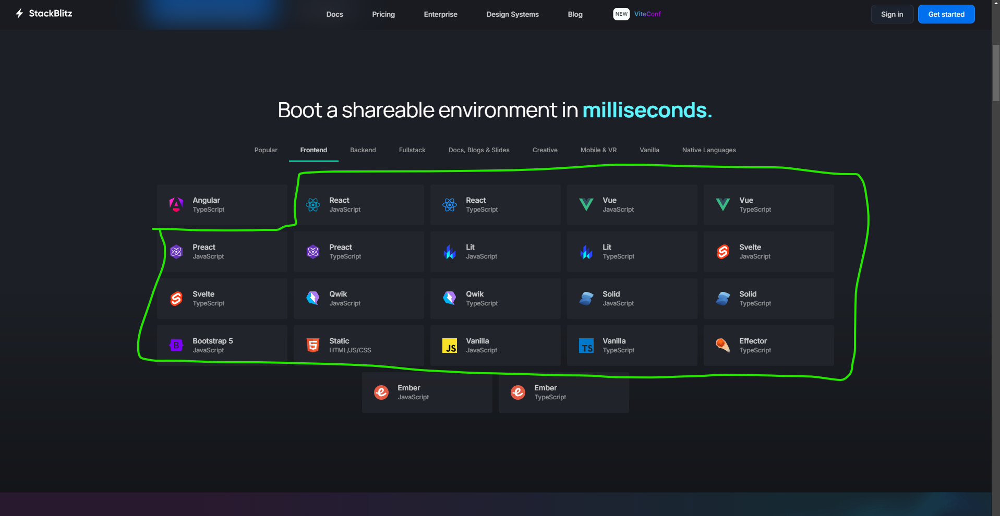
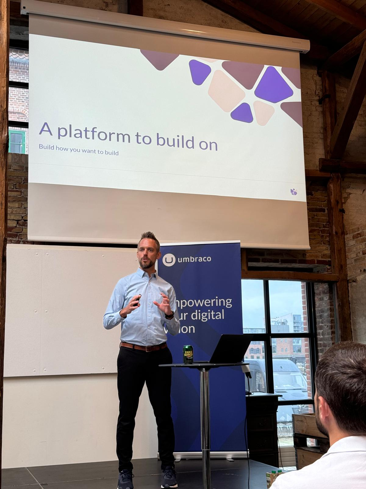

---
# You can also start simply with 'default'
theme: './theme'
# some information about your slides (markdown enabled)
title: Put v14 to the test - Extending the backoffice like you want to
info: |
  ## DF24
  Guus Noij - Perplex Digital Bv.

# apply unocss classes to the current slide
class: text-center
# https://sli.dev/features/drawing
drawings:
  persist: false
# slide transition: https://sli.dev/guide/animations.html#slide-transitions
transition: slide-left
# enable MDC Syntax: https://sli.dev/features/mdc
mdc: true

themeConfig:
  primary: '#F75E9E'

fonts:
  sans: Outfit
  weights: '200,400,600,700'
---


<video class="absolute w-full h-full left-0 top-0 object-cover z-[-2]" src="./assets/perplex-mov-1.mp4" muted autoplay loop />

<div class="absolute h-[40px] w-full bg-black left-0 top-0 flex items-center justify-between px-5">
  
  <div class="text-[12px]">DF24: Dutch Umbraco Community Conference</div>
</div>

<div class="text-left flex flex-col justify-end absolute left-0 top-0 h-full w-full py-14 px-14">

  # <div class="font-semibold text-[50px] leading-tight">Put v14 to the test</div>

  <div class="text-white font-regular text-[32px] -mt-4">
    Extending the backoffice like you want to
  </div>

  <div class="flex gap-5 items-center mt-5">
    <div class="relative size-[55px] rounded-full overflow-hidden">
      
    </div>
    <div class="flex flex-col gap-1.5 text-[12px]">
      <p class="!leading-none !my-0 font-semibold">Guus Noij</p>
      <p class="!leading-none !my-0">Front-end developer</p>
    </div>
  </div>
</div>

---
layout: image-right
image: ./assets/imge.webp
transition: fade-out
---

# Introduction

Perplex Digital

- **Digital agency located in Arnhem**

- **Use of Umbraco exclusively**
  - All client projects
  - Mobility sector
- **Known for packages**
  - Perplex.ContentBlocks
  - uMarketingSuite
  - Perplex AI Assistant
  - Perplex AI Contentbuddy

---
layout: image-left
image: ./assets/guus-res.jpg
transition: fade-out
---

# Introduction 
About me

  - About 4 years at Perplex
  - Lead front-end developer
  - Worked on developing & maintaining packages

---
layout: image-right
transition: fade-out
---

# What is this presentation about

- Umbraco v14's flexibility

- Our pitfalls in migrating packages
- Get inspired to build/migrate packages
- See a live demo
  - Real examples using modern frameworks

---
layout: section
transition: fade-out
---

# Congratulations on v14
## RIP AngularJS

---
layout: image-right
image: https://umbraco.com/media/rldb4d1f/umbraco-14-architecture-overview_1200x800px.png?quality=80&format=webp
---

# Congratulations on v14

- Remarkable achievement
- W3C Web standards
- Web components
- Extensible

- Impressive [Umbraco Backoffice repo](https://github.com/umbraco/Umbraco.CMS.Backoffice) and [Umbraco UI repo](https://github.com/umbraco/Umbraco.UI)

<!-- Footer -->
<ul class="footnotes">
  <li>1. https://github.com/umbraco/Umbraco.CMS.Backoffice</li>
  <li>2. https://github.com/umbraco/Umbraco.UI</li>
</ul>

---
---

```json {all|7|all} twoslash
// ~/App_Plugins/WelcomeDashboard/umbraco-package.json

{
  "type": "dashboard",
  "alias": "my.welcome.dashboard",
  "name": "My Welcome Dashboard",
  "element": "/App_Plugins/WelcomeDashboard/dashboard.js",
  "weight": -1,
  "meta": {
    "label": "Welcome Dashboard",
    "pathname": "welcome-dashboard"
  }
}
```

<arrow v-click="[1, 2]" x1="700" y1="130" x2="500" y2="164" color="#953" width="2" arrowSize="1" />

---
layout: section
---

# Current state of umbraco v14 packages

---
layout: default
---

# Current state of umbraco v14 packages



---
layout: two-cols
transition: none
---

# Categories

- Analytics & Insights <span class="font-bold" v-click="1">(8)</span>

- Campaign & Marketing <span class="font-bold" v-click="1">(9)</span>
- Commerce <span class="font-bold" v-click="1">(27)</span>
- Developer Tools <span class="font-bold" v-click="1">(100)</span>
- Editor Tools <span class="font-bold" v-click="1">(110)</span>

## <span v-click="1">Total any version: <span class="text-[#F75E9E]">359</span></span>

::right::

<br />
<br />

- Headless <span class="font-bold" v-click="1">(10)</span>

- PIM & DAM <span class="font-bold" v-click="1">(5)</span>
- Search <span class="font-bold" v-click="1">(13)</span>
- Themes & Starter Kits <span class="font-bold" v-click="1">(60)</span>
- Translations <span class="font-bold" v-click="1">(17)</span>

<!-- Footer -->
<ul class="footnotes">
  <li>1. https://marketplace.umbraco.com/</li>
</ul>

---
layout: two-cols
transition: fade-out
---

# Categories

- Analytics & Insights <span class="font-bold">(2)</span>

- Campaign & Marketing <span class="font-bold">(5)</span>
- Commerce <span class="font-bold">(16)</span>
- Developer Tools <span class="font-bold">(29)</span>
- Editor Tools <span class="font-bold">(18)</span>

## <span>Total any version: 359</span>
## <span>Total v14 support: <b class="text-[#F75E9E]">75</b></span>

::right::

<br />
<br />

- Headless <span>(1)</span>

- PIM & DAM <span>(0)</span>
- Search <span>(3)</span>
- Themes & Starter Kits <span>(1)</span>
- Translations <span>(0)</span>

<!-- Footer -->
<ul class="footnotes">
  <li>1. https://marketplace.umbraco.com/</li>
</ul>

---
layout: statement
transition: fade-out
---

# Challenge
## Most of the work is still left to be done

---
layout: default
transition: fade-out
---

# And it's not only about migrating

<br />

- ## Migrating packages

<div v-click="1">
  <br />

  - ## Creating new packages
</div>

---
layout: statement
transition: fade-out
---

# So we need developers

---
layout: default
transition: fade-out
image: './assets/developers.gif'
---

# So we need developers


---
layout: default
---

# The vision for v14
### - <a href="https://umbraco.com/blog/bellissima-preview-releases-of-the-new-backoffice/">Project Belissima 😘👌</a>

<br />

- Built on modern technology
- Easy to maintain and develop
- Be the most extendable CMS around

- Available features
  - UI Component library
  - Context API
  - Management API

<!-- Footer -->
<ul class="footnotes">
  <li>1. https://umbraco.com/blog/bellissima-preview-releases-of-the-new-backoffice/</li>
</ul>

---
layout: default
transition: fade-out
---

# What this means for v14

- You don't have to be an AngularJS developer anymore
- All you need is to have the skillset of a (modern) web developer
  - Javascript or Typescript
  - CSS

- Intermediate level
  - Some knowledge of a build tool like ViteJS
  - LitJS

---
layout: default
---

# Attracting enthusiastic developers


---
layout: default
---

# The vision for v14
### - <a href="https://umbraco.com/blog/bellissima-preview-releases-of-the-new-backoffice/">Project Belissima 😘👌</a>

<br />

- Everyone should extend without having to be **hacky**
  - Isolated Web components 
- Umbraco isn't opinionated **how** the extension behaves inside web components
  - The docs can guide you
  - But if you'd rather do it different, it **should** be up to the developer

<br />


<!-- Footer -->
<ul class="footnotes">
  <li>1. https://umbraco.com/blog/bellissima-preview-releases-of-the-new-backoffice/</li>
</ul>

---
layout: section
transition: fade-out
---

# Build how you want to build

---
layout: section
transition: fade-out
---

# Perplex Digital - Challenges
## Preparing and migrating to v14+

---
layout: two-cols-header
transition: fade-out
---

# Challenges migrating packages
- **Perplex** has lots of internal packages

  - Large packages, medium packages and small packages
- Most are small
  - simply visualize some data from a C# api or 
  - customer specific property editors

---
layout: two-cols-header
transition: fade-out
---

# List of some of the Perplex Packages

::left::

- [Perplex.Contentblocks](https://github.com/PerplexDigital/Perplex.ContentBlocks)

- Hangfire
- Redirect Manager
- Accessibility Checker
- Content Dashboard
- Perplex.Mail
<br />
<br />
<br />
<br />
<br />
<br />

::right::

- Ai.ContentBuddy

- BackOfficeAuthorization
- Perplex.Contentblocks.Screenshot
- MarkdownEditor
- Fieldmap
<br />

<!-- Footer -->
<ul class="footnotes">
  <li>1. https://umbraco.com/blog/bellissima-preview-releases-of-the-new-backoffice/</li>
</ul>

---
layout: statement
---

## So there are a lot

---
layout: default
transition: fade-out
image: './assets/developers.gif'
---

# So Perplex needs developers


---
layout: default
---

# Luckily we have them
- Backend developers (C#)

- Frontend developers (HTML, CSS & Javascript)

---
layout: statement
transition: fade-out
image: './assets/developers.gif'
---

## <span class="text-[#F75E9E] text-[40px]">But who will do it?</span>

---
layout: quote
---

<blockqoute style="font-size:40px;">
"Ellard & Guus, you know this Vite and Typescript magic. How should we migrate <a href="https://github.com/PerplexDigital/Perplex.ContentBlocks" target="_blank">PerplexContentBlocks?</a>"
</blockqoute>

<!-- Footer -->
<ul class="footnotes">
  <li>1. https://github.com/PerplexDigital/Perplex.ContentBlocks</li>
</ul>

---
layout: default
---

# About Perplex Contentblocks

<v-switch>
  <template #1></template>
  <template #2></template>
  <template #3></template>
  <template #4></template>
</v-switch>

<arrow v-click="[3, 4]" x1="700" y1="190" x2="400" y2="210" color="#F75E9E" width="2" arrowSize="1" />

---
layout: default
---

# Euuhm, so we had the idea:

- Can we try to migrate it using VueJS

- Bundled with ViteJS coming together as a webcomponent. 
- Perplex Front-end developers really prefer VueJS over Lit for reactivity.

---
layout: statement
transition: fade-out
---

## <span class="text-[#F75E9E]">I mean we're Front-enders right?</span>
<br />

### Frameworks for everything, and everyone has their favorite

---
layout: image
image: ./assets/framework-wars-2.webp
transition: fade-out
---

---
layout: image
image: ./assets/framework-wars.webp
transition: fade-out
---

---
layout: default
---

# Javascript framework wars is maturing
- Front-end landscape is **still** moving fast

- But, javascript frameworks are maturing
- **So:** Which is the best?

---
layout: statement
---

# What is your favorite?

---
layout: statement
---

## I know <span class="underline decoration-wavy decoration-[#4d64ff]">Lit</span> is not the preferred framework of the developers at Perplex

---
layout: image
image: ./assets/developer-magnet.webp
---

---
layout: statement
transition: fade-out
---

## We had to challenge if Umbraco v14 also supports other frameworks

---
layout: default
---

# So at Perplex we embarked on a journey
- Well to put it lightly we had some troubles and mistakes were made. 
- But it is an interesting adventure on which I want to take you in this coming demo

---
layout: default
---

# Use whatever framework you'd like

- Webcomponents are simple, what happens inside can be complex

- We'd like to **embrace the complexity from within** with our preferred framework
- Can we still interact with 
  - The **Context api** and other Umbraco/Lit specific patterns
  - Can we do it for **dashboard**?
  - How about a value for the **Property editor**?

---
layout: default
---

# Our Proof of Concept

- A backoffice with
  - Angular 18
  - React
  - Vue
- What might happen? 
  - Maybe the backoffice explodes with all this javascript?

---
layout: fact
---

## Let's find out!

---
layout: statement
transition: fade-outs
---

# But before that
## Time for a very quick crash course how a new v14 extension is made

---
layout: default
---

[Umbraco 14.latest docs - tutorial - Creating your first extension](https://docs.umbraco.com/umbraco-cms/tutorials/creating-your-first-extension)

```json {all|10}
{
  "$schema": "../../umbraco-package-schema.json",
  "name": "My.Vanilla.Extension",
  "version": "0.1.0",
  "extensions": [
    {
      "type": "dashboard",
      "alias": "my.vanilla.extension",
      "name": "My Vanilla Extension",
      "js": "/App_Plugins/my-vanilla-extension/vanilla-extension.js",
      "weight": -1,
      "meta": {
        "label": "My Vanilla Extension",
        "pathname": "my-vanilla-extension"
      },
    }
  ]
}
```

<!-- Footer -->
<ul class="footnotes">
  <li>1. https://docs.umbraco.com/umbraco-cms/tutorials/creating-your-first-extension</li>
</ul>

---
layout: default
---

/App_Plugins/my-vanilla-extension/vanilla-extension.js
```ts {all|4-13|14|17,20,29|38|4-13|1-2|14|15,26-28|22-24,30-35}{maxHeight:'380px'}
import { UmbElementMixin } from "@umbraco-cms/backoffice/element-api";
import { UMB_NOTIFICATION_CONTEXT } from "@umbraco-cms/backoffice/notification";

const template = document.createElement("template");
template.innerHTML = `
  <uui-box>
    <h1>Welcome to my dashboard</h1>
    <p>Example of vanilla JS code</p>

    <uui-button label="Click me" id="clickMe" look="secondary"></uui-button>
  </uui-box>
`;

export default class MyDashboardElement extends UmbElementMixin(HTMLElement) {
    #notificationContext;

    constructor() {
        super();
        this.attachShadow({ mode: "open" });
        this.shadowRoot.appendChild(template.content.cloneNode(true));

        this.shadowRoot
            .getElementById("clickMe")
            .addEventListener("click", this.onClick.bind(this));

        this.consumeContext(UMB_NOTIFICATION_CONTEXT, (instance) => {
            this.#notificationContext = instance;
        });
    }

    onClick = () => {
        this.#notificationContext?.peek("positive", {
            data: { headline: "Hello" },
        });
    };
}

customElements.define("my-vanilla-extension", MyDashboardElement);
```

<!-- Footer -->
<ul class="footnotes">
  <li>1. https://docs.umbraco.com/umbraco-cms/tutorials/creating-your-first-extension</li>
</ul>

---
layout: default
---



<!-- Footer -->
<ul class="footnotes">
  <li>1. https://docs.umbraco.com/umbraco-cms/tutorials/creating-your-first-extension</li>
</ul>

---
transition: fade-out
layout: section
---

# Can we do the same for a VueJS and other framework component?

---
transition: fade-out
layout: section
---

# Let's have a look in the code editor

---
transition: fade-out
layout: section
---

# So what was this madness?

---
---

# To summarize
- The flexibility of Bellisima really is there
  - ✅ Dashboards
  - ✅ Setting Property editor values
  - ✅ Using Context api
  - ✅ jQuery support!
- Vue and React are working very well
  - unfortunately due to a [bug introduced in 1.8.0](https://github.com/umbraco/Umbraco.UI/issues/831) we can't use all the UUI components (yet)
- Frameworks like Angular aren't very compatible with the Context API 
  - it doesn't use ViteJS (and Rollup). And there seem to be a problem with the Tree shaking.

<!-- Footer -->
<ul class="footnotes">
  <li>1. https://github.com/umbraco/Umbraco.UI/issues/831</li>
</ul>

---
layout: default
---



---
transition: fade-out
layout: default
---

# For us

- Perplex.Contentblocks migration continues in Lit 

  - Unfortunately we can't wait for the bugfix
- For the other packages we probably are going to use VueJS
- Very happy in the future we can make client specific property editors in VueJS

---
transition: fade-out
layout: section
---

# It depends on the preferences you as a developer have

---
transition: fade-out
layout: section
---

# But Belissima is starting to make it possible

---
transition: fade-out
layout: default
---

# Build how you want to build


---
transition: fade-out
layout: default
---


---
transition: fade-out
layout: default
---


---
transition: fade-out
layout: section
---

# Thank you

<ul class="footnotes text-left left-45">
  <li>1. https://github.com/PerplexDigital/PutV14ToTheTest/</li>
</ul>

